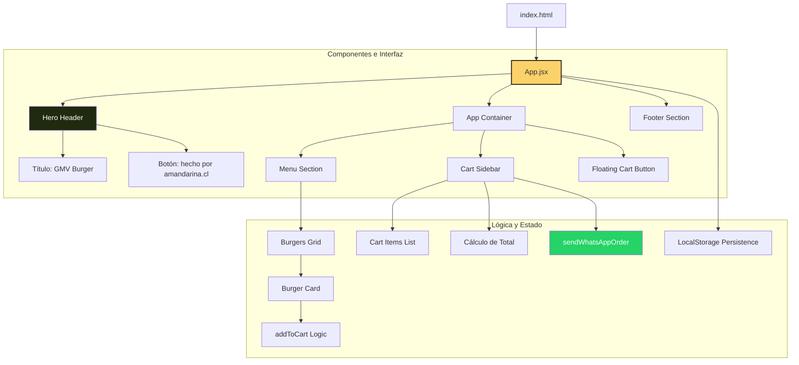

**pedidoHAM** (también conocida como **Giovanny Burger** o **GMV Burger**) es una aplicación web desarrollada con React 19 y Vite para digitalizar el menú y el proceso de pedidos de una hamburguesería artesanal. Fue construida para que los clientes puedan explorar el catálogo de hamburguesas, armar su pedido en un carrito que persiste entre sesiones y, con un solo clic, enviar el resumen completo directamente al número de WhatsApp del restaurante — sin formularios, sin cuentas, sin esperas.

<CardGroup cols={2}>
  <Card
    title="Quickstart"
    icon="rocket"
    href="/quickstart"
  >
    Clona el repositorio, instala dependencias y levanta el servidor en menos de 5 minutos.
  </Card>
  <Card
    title="Menú interactivo"
    icon="burger"
    href="/introduction"
  >
    Nueve hamburguesas con imagen, ingredientes, precio y etiquetas de popularidad en una cuadrícula responsiva.
  </Card>
  <Card
    title="Carrito de compras"
    icon="cart-shopping"
    href="/introduction"
  >
    Agrega, ajusta cantidades y elimina productos; el carrito se guarda automáticamente en LocalStorage.
  </Card>
  <Card
    title="Integración WhatsApp"
    icon="whatsapp"
    href="/introduction"
  >
    Un botón genera el mensaje de pedido formateado y abre WhatsApp Web con el número del restaurante.
  </Card>
</CardGroup>

## Arquitectura

La aplicación sigue una estructura de árbol de componentes de un solo archivo principal (`App.jsx`) que orquesta toda la interfaz y el estado. El **Hero Header** encabeza la página con el nombre del restaurante y el horario de atención. Debajo, el **App Container** contiene tres elementos en paralelo: la **Menu Section** (cuadrícula de tarjetas de hamburguesas), el **Cart Sidebar** (resumen del pedido, totales y el botón de WhatsApp) y el **Floating Cart Button** que aparece en móvil cuando el carrito tiene al menos un producto. La persistencia del carrito se maneja directamente desde `App.jsx` mediante `useEffect` + `localStorage`, sin ningún store externo.

## Tecnologías

<CardGroup cols={2}>
  <Card title="React 19" icon="react">
    Biblioteca principal de UI. Usa `useState` para el carrito y `useEffect` para la sincronización con LocalStorage. Versión `^19.2.5`.
  </Card>
  <Card title="Vite 8" icon="bolt">
    Herramienta de build ultrarrápida para desarrollo y producción. Versión `^8.0.10`. Configurada con el plugin oficial `@vitejs/plugin-react`.
  </Card>
  <Card title="Lucide React" icon="icons">
    Set de iconos SVG limpios y modernos. Versión `^1.9.0`. Usado en botones, badges del menú y controles del carrito (`ShoppingCart`, `Flame`, `Crown`, `Star`, etc.).
  </Card>
  <Card title="CSS3" icon="css3">
    Estilos personalizados en `App.css` sin librerías externas. Incluye diseño responsivo con media queries y layout flex/grid para el menú y el sidebar.
  </Card>
</CardGroup>

<Note>
  pedidoHAM **no requiere ningún backend, base de datos ni servidor propio**. Toda la lógica — catálogo de productos, estado del carrito y generación del mensaje de WhatsApp — corre íntegramente en el navegador del cliente. La única integración externa es la URL `https://wa.me/` de WhatsApp, que es una redirección pública.
</Note>
